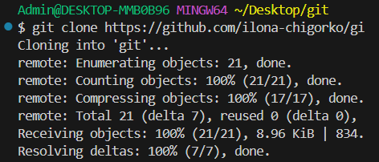
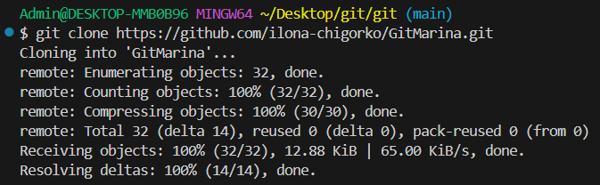
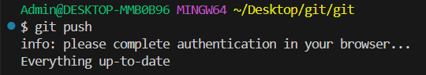
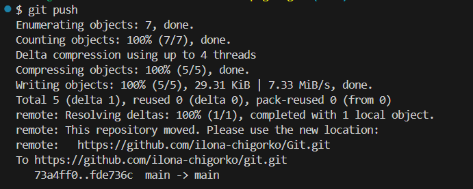

## 1. 
```
git version
```
* Если Git установлен на компьютер, вы увидите его текущую версию

## 2. 
''' 
git init
''' 
* указываем папку, в которой git начнёт отслеживать изменения

* в папке создаётся скрытая папка .git

## 3. 
''' 
git status
''' 
* показывает текущее состояние гита, есть 
ли изменения, которые нужно закоммитить
(сохранить)

## 4. 
''' 
git add
''' 
* добавляет содержимое рабочего каталога 
в индекс (staging area) для последующего коммита. Эта команда дается после добавления
файлов. Писать название целиком не обязательно: терминал дозаполнит данные автоматически.

## 5. 
''' 
git commit
''' 
* зафиксировать или сохранить
По умолчанию __git commit__ использует лишь этот индекс, так что вы можете использовать __git add__ 
для сборки слепка вашего следующего коммита.
Команда __git commit__ берёт все данные, добавленные в индекс с помощью __git add__, и сохраняет их
слепок во внутренней базе данных, а затем сдвигает указатель текущей ветки на этот слепок.

## 6. 
''' 
git log
''' 
* Журнал изменений

* Перед переключением версии файла в Git
используйте команду git log, чтобы увидеть
количество сохранений

## 7. 
''' 
git checkout
''' 
* Переключение между версиями

* Для работы нужно указать не только
интересующий вас коммит, но и вернуться 
в тот, где работаем, при помощи команды __git checkout master__.

## 8. 
''' 
git diff
''' 
* Показывает разницу между текущим файлом и сохранённым
* Перед переключением версии файла в Git используйте команду git log, чтобы увидеть количество сохранений


# _Синтаксис языка Markdown_ 
* Жирный текст — *
* Курсивный текст — *
* Зачеркнутый текст — ~
* Выделяют заголовки — # в начале строки
* Показать уровень заголовка — подчеркивание знаками = или ****
* Нумерованные Списки — обозначаются обычными цифрами 1, 2, 3
* Ненумерованные Списки — обозначаются *знаками в начале строки
* Вложенные Списки — выполняем отступы


## 9. 
''' 
git branch <название новой ветки>
''' 
* Позволяет создать ветку в папке с репозиторием.


## 10. 
''' 
git merge <имя ветки для слияния с текущей>
''' 
* Команда для слияния веток


## 11. 
''' 
git ignore
''' 
* Команда для исключения не нужных файлов из загрузки


## 12.
''' 
git clone
''' 
* Составная команда, она не только загружает все изменения, но и пытается слить все ветки в удаленном репозитории




## 13. 
''' 
git push
''' 
* Позволяет отправить свою версию репозитория во внешний репозиторий (нужна авторизация)




## 14. 
''' 
git pull
''' 
* команда позволяет скачать все из текущего репозитория и автоматически сделать merge с нашей версией


## 15. 
'''
pull request
''' 
* Команда для предложения изменений владельцу репозитория
